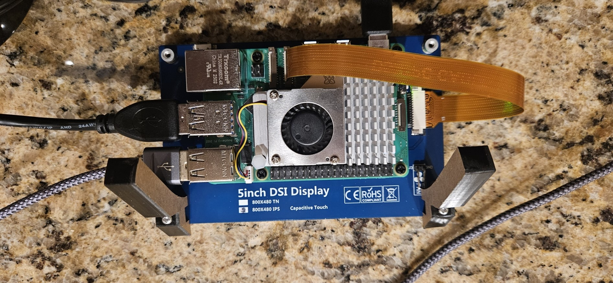
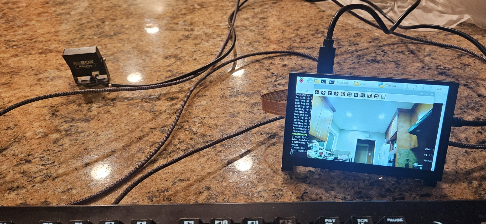

# RaspberryPiCameraViewer

## Project Description
A simple program that can display a USB camera connected to a Raspberry Pi.

## Components 
- Raspberry Pi 5
- 5-inch touchscreen DSI display (FNK0078)
- DSI Ribbon Cable
- ArduCam USB Camera (BO560?)
- USB-C Power Supply Input: 100–240 VAC, Output: 5 VDC, 5 A, 25 W (ABT-PD30W1C)
- Raspberry Pi 5 Active Cooler, 5 VDC (SC1148)
- 2x Display Stand Legs

## Pictures of Project

